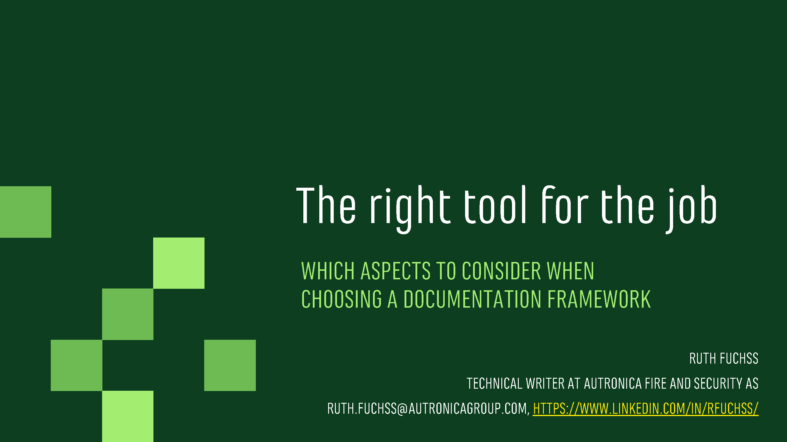
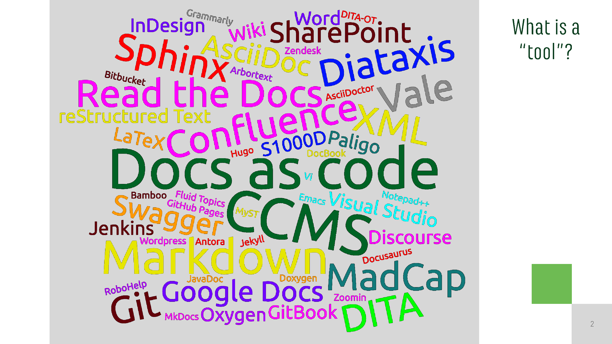
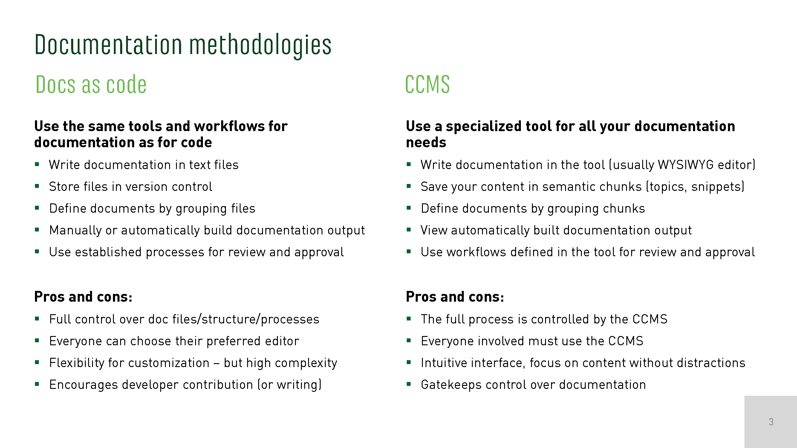
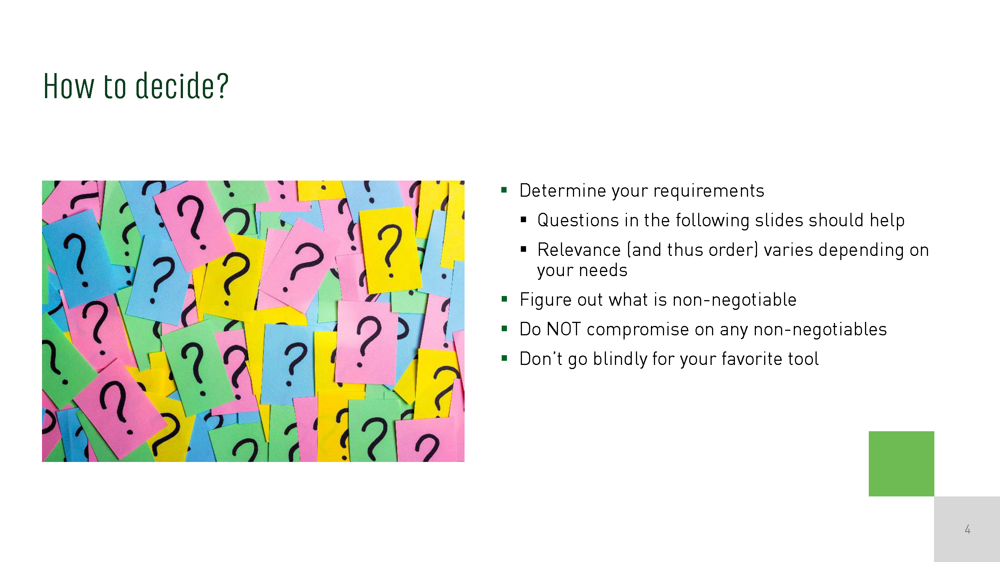
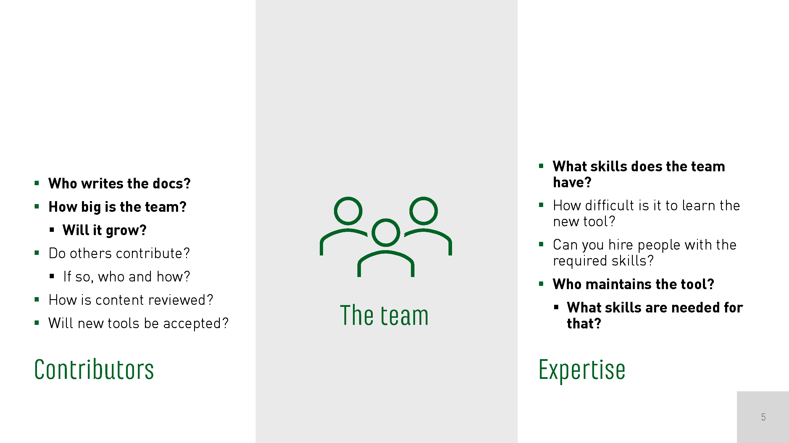
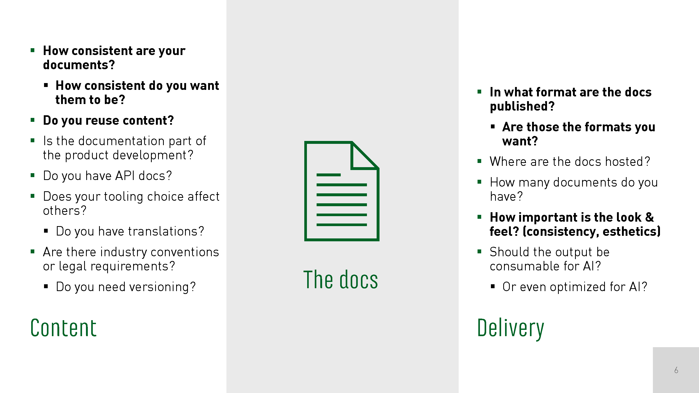
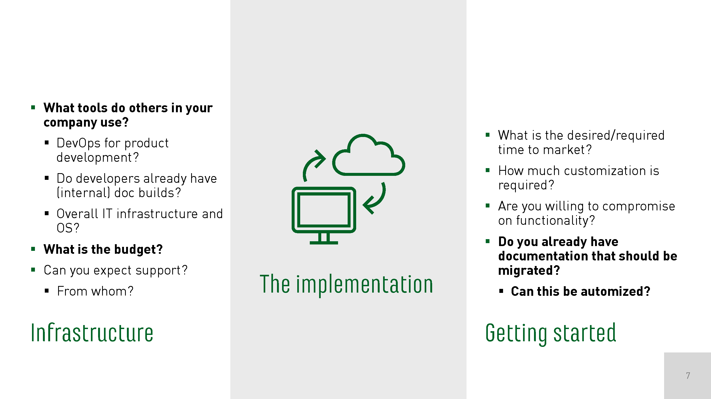
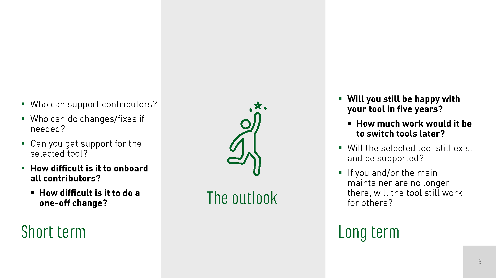

# The right tool for the job - WTD conference Berlin October 2025

Say you can start over with your documentation, or build up a new documentation setup from scratch – how do you start, and how can you figure out which is the right tool to choose?

Short about my background: I've worked in both software and hardware documentation, in very different environments. I started my documentation career working in a DITA CMS, before I moved on to a "home-grown" DITA docs-as-code approach (actually a while before "docs-as-code" was a term that was used much). At the same time, I did software documentation in  Doxygen and Sphinx, both in a docs-as-code approach, and started to get my hands dirty with extending and automating our documentation builds.

About a year ago I started working at Autronica, a hardware company that - like most hardware companies - was doing their documentation in a rather old-fashioned way: Their documentation was in Word and InDesign files stored in SharePoint, and content reuse was achieved by copying content between files.
They were painfully aware of all the issues with their documentation though, and when I started, I had free reign to modernize the documentation. So my first task was to select the right tool for the job!

> [!NOTE]
> This document is a rough write-up of [my talk at the Write-the-Docs conference](https://www.writethedocs.org/conf/berlin/2025/speakers/#speaker-ruth-fuchss-the-right-tool-for-the-job-ruth-fuchss) in Berlin in October of 2025.
> It also contains my speaker notes for the parts that I had to cut for the talk.
> 
> Some content has been added after the talk based on feedback from the community. This content is not reflected in the slides.
> If you have additions or corrections, feel free to open an issue or send a pull request!

## What is a "tool"?

The first question is of course - what do I mean with “tool”?

There is a huge amount of documentation tools out there (the word cloud in the slide is by no means exhaustive), and picking the right tool out of this heap seems overwhelming.

It gets a little more manageable when you start classifying the different tools:

- Yellow: markup languages (or syntax, format) - how you write your documentation
- Red: engines - how to transform what you've written to output
- (Orange: engine+markup)
- Light blue: editors for plain-text files
- Purple: specialized editors that come with an integrated engine (Arbortext/Oxygen for DITA, Word/InDesign as WYSIWYG editors - they also use an underlying syntax, but you're not aware of it)
- Pink: delivery platforms (Read the Docs for building and hosting, wiki/forum for publishing your content right after saving, Zoomin/FluidTopics for ingesting, processing, and presenting your content)
- Brown: storage/version control and build servers/frameworks
- Blue: content frameworks for structuring content (also DITA in light green, because it's both a content framework and a syntax)
- Gray: doc checkers for validation
- Dark green: doc methodologies

When choosing your toolchain, you can mix and match - some combinations make sense (for example, using Sphinx with Markdown), others are possible but maybe don't make as much sense (for example, storing your Word files in Git), and others simply won't work (for example, editing your InDesign files in Notepad++ or storing your CCMS content on Read the Docs).

Therefore, make sure not to compare apples and oranges when choosing your tools, and make sure you're comparing actual alternatives. 
For example, I got stuck on the decision between DITA and docs-as-code, even though those two aren't actually alternatives.

For me, things started to fall into place once I realized that the decision about the doc methodology is distinct from the decision about the actual tooling. 
It might not be the first decision you take (or can take), but it's a very central one.

## Documentation methodologies

Docs as code gives you full control over your files and the flexibility to fully customize your documentation - if you can program it, you can do it in your docs.
That comes with a rather high complexity though.

CCMS is a bit of a black box and comes with streamlined workflows and processes, targeted specifically towards documentation work.
You can of course tweak those a bit, but your focus is on the content, not how your documentation is built.

Which of these to choose is a bit of a mindset question: How do you and your company view documentation? What works best for your documentation?
It's impossible to split up the pros and cons for each approach, because they can all be an advantage or disadvantage, depending on interpretation.

> [!NOTE]
> After the talk, I noticed that Desktop Publishing (Word, InDesign, etc.) should have been another option on this slide - because it IS another alternative.
> The pros and cons would be full control of the output (no split between content and layout), easily accessible tools (with limited flexibility), and tool familiarity/ease of use (if the tools do what you want them to do).

## How to decide?

The following slides have a lot of questions that you can use to figure out your requirements.
I had to put them in some order, of course, but that does not mean you should answer them in order.
The order and relevance will depend on your scenario.

Make sure to decide which points you will not compromise on, and stay strict on those non-negotiables – don’t plan with workarounds!

My main non-negotiable was PDF support.
All our documentation is currently in PDF, and because of certification and tracking, those PDFs will not go away any time soon.
My logical choice would have been to go with Sphinx, which I'm most familiar with.
And while Sphinx can do decent PDFs, it's not made for PDFs, but for HTML (and PDF builds go through LaTeX, which can be a pain).
Therefore, I ended up with a choice between DITA and AsciiDoc - and, as mentioned on the previous slide, the choice between a CCMS and docs-as-code.

## The team

### Contributors

- **Who writes the docs?**
  This might be only the technical writer(s), only the developers, or both.
  The answer impacts who will be affected by your choice, who should have a say, and whose needs have priority (for example, is it easier to make developers work in a CMS or technical writers in the development team’s Git repository?).
- **How big is the team?**
  Are you a single writer or a technical writer team? 
  If many people are involved, a more professional/off-the-shelf solution (a CCMS) might be easier to use, and it can enforce more constraints.
  For a few people, a home-grown solution (docs as code) might be sufficient because less coordination required, and it gives more flexibility.
  
  - **Will it grow?**
    If you're going for a home-grown solution, will that scale in the future? 
	Maybe "play it safe" by going for an established docs-as-code system like Read the Docs.
	
	Also keep in mind that even if no growth is planned, the amount of documentation will likely grow.
	To keep on top of that, you'll need to involve developers more - and to do that, you should make it as easy as possible for them to contribute.
- **Do others contribute?**
  Think about external and/or casual contributors that are not part of the core documentation team.
  You should make it as quick and easy as possible to contribute.
  
  - **If so, who and how?**
    Consider the background of the contributors - what is easier for them? (For example, a wiki vs. a Git repo.)
    Also, do external contributors have access to the sources? This might be difficult in a CCMS.
- **How is content reviewed?**
  Do you do live changes (usually in a wiki or forum), or is content reviewed (for example, through iterations with comments in Word/Google docs or tracked sign-offs in GitHub?
  
  How flexible are you / do you want to be for small changes (for example, typo fixes). Do you want to require a strict process or do you prefer some flexibility?
- **Will new tools be accepted?**
  Consider how your team will react to changes like new workflows, new skills to learn, or dividing up content and styling.
  If needed, do small changes to increase acceptance (for example, if your documents are currently in Word, consider moving to a wiki instead).
  Another option is to change the tools but keep existing workflows in place as much as possible - you can still accept input in Word files even if you changed your toolchain to docs-as-code.

### Expertise

- **What skills does the team have?**
  Who is comfortable working on the command line and in git? Who is comfortable figuring out a GUI?
  
  Consider if there are different user groups - technical writers, software developers, hardware developers, product managers, project teams, ...
- **How difficult is it to learn the new tool?**
  Do you need instructions or checklists? Are there courses available?
  Or is it intuitive / given by the workflow?
- **Can you hire people with the required skills?**
  Especially if you're expecting your team to grow, can you find people that will be comfortable working in the new environment?
  This depends both on the industry and the region - docs-as-code is still rather "exotic" in hardware documentation, for example. 
  Also, DITA seems to be a very common skill for technical writers in Finland, but not so much in Norway.
- **Who maintains the tool?**
  Who sets the tool up and maintains it?
  This could be yourself if you have the required skills, or someone in your company (for example, a developer or someone from IT), or an external contractor.
  
  - **What skills are needed for that?**
    Consider not only the tool itself - developers might not be familiar with it.
	Therefore, look at the underlying framework: For example, Sphinx is built on Python, AsciiDoc on Ruby, and DITA-OT on XSLT.
	XSLT skills are probably the hardest to find - but if you hire external contractors, they are typically experts, which might be more useful than a developer hacking Ruby without really knowing it.

## The docs 

### Content

- **How consistent are your documents?**
  Do you have many similar documents or a wide range of documents (for example, hardware and software documentation, guides for different audiences)?
  
  - **How consistent do you want them to be?**
    You can enforce consistency through a structured writing tool with rigid templates, for example DITA.
	This can make it easier to keep documents consistent even if they are written by different people.
	However, if your content is quite diverse, using DITA might mean that you need to force your content into a rigid structure.
	So in this case, and if you want to be more flexible, a solution like Markdown might be preferable.
	
- **Do you reuse content?**
  Most tools (even Word) can do simple reuse of files.
  However, things get more complicated when you need snippets, text variables, or conditional text (for example, if you have similar products that share a lot of content, but have different product names and some small difference in supported features).
  Not all tools provide this advanced reuse (not even plain Markdown).
  DITA, AsciiDoc, and restructuredText can do it, but use very different methods/syntax for it.
- **Is the documentation part of the product development?**
  Is the documentation development on the same timeline as the product development? 
  Often it is for (agile) software development. 
  For hardware, documentation is usually a bit behind.
  If documentation is part of product development, using the same workflows (and maybe even the same repository) might be a good idea - so docs-as-code. 
  If not, you have more flexibility in choosing your methodology (you can still use docs-as-code, just not as integrated).
- **Do you have API docs?**
  If you have API docs, you can keep them separate from your conceptual documentation or integrate them.
  If you choose to integrate them, does that cause you to loose flexibility for your conceptual docs (for example, moving all your docs to Doxygen because this is what your API docs use)? 
  And if so, is that worth it, or would you be better off just linking to your API docs?
- **Does your tooling choice affect others?**
  Think about anyone outside your company that might be affected.
  Does anyone use your documentation as a base for their documentation?
  Does anyone re-brand your documentation?
  
  Also the other way around: Do you integrate other documentation sets (that you - or they - would need to migrate)?
  Do you re-brand other documentation?
  
  - **Do you have translations?**
    Do you work with a translation agency, and if so, can they work with your new tool?
	(Also consider that if you go from Word/InDesign to an approach that uses plain text files, translation handling might become easier and thus cheaper.)
	
	If you use AI translations, will that work with your new format?
	
- **Are there industry conventions or legal requirements?**
  Hardware documentation usually requires versioning and sign-off.
  Software documentation often uses continuous delivery.

  - **Do you need versioning?**
    If so, at what level? For the full document, each topic, or do you need to highlight all changes?
    This also touches on the next section - delivery - because what you can do also depends on the output format.

### Delivery

- **In what format are the docs published?**
  Common formats are HTML and PDF, but you might need other formats like epub, Help files, or XML.
  Which of the formats is the main format for your documentation?
  
  Most tools can create some kind of PDF, but it might be difficult to generate a pretty and reliable PDF.
  Both DITA and AsciiDoc provide native support for PDFs, which is usually easier to work with than approaches that are "on top" of other formats (for example, Sphinx' PDF generation goes through LaTeX, which can cause problems).
  
  Similarly, most tools can generate HTML (consider the quality though - Word-generated HTML might not be anything you want to publish ...), but also think about where to host your output.
  - **Are those the formats you want?**
    If you plan to add other formats in the future (for example, PDFs for your HTML documentation), consider this already when choosing the tool.
 
- **Where are the docs hosted?**
  This question is relevant mostly for HTML documentation.
  PDF documents must of course be hosted somewhere as well, but uploading single files to your website is usually easier to manage.
  
  Typical options are the company website or a hosting platform like Read the Docs (which you can use with a custom URL as well).
- **How many documents do you have?**
  Do you have one big documentation center that contains your full documentation?
  Or many individual documents (for example, for different products, or a knowledge base)?
  Do you link between documents? Do you need to keep your documents in sync?
  
  This question is important to consider for hosting, and if there is a mismatch between formats (for example, one HTML documentation set that corresponds to different PDFs).
  For complicated scenarios, consider using a content delivery platform (like Zoomin or FluidTopics).
- **How important is the look & feel? (consistency, aesthetics)**
  This question is mostly relevant for deciding between desktop publishing (where you have full control over the look and feel) and an approach where you split up the content from the presentation.
  
  If you want consistency in your documentation, you should split content and presentation.
  This way, you can fully focus on the content when writing (and use simple markup to denote, for example, lists).
  All formatting, styling, fonts, colors, etc. is taken care of automatically when building your output.
  
  However, if you care a lot about aesthetics (for example, if a picture appears at the bottom of page X or the top of page Y, or where a page break happens), this is is something you cannot necessarily control in this approach.
  Therefore, desktop publishing might be the way to go then.
  
  Another aspect to this question is that you might have documents from different sources (for example, API and conceptual documentation, or legacy documentation from older tools).
  Can that be visible or should everything look the same?
  If you want it to look the same, go for a content delivery platform.
- **Should the output be consumable for AI?**
  This question touches on many aspects already mentioned: consistency, semantic markup, hosting (retrievability), content vs. layout.
  The easier to process for an AI, the better the result should be.
  
  - **Or even optimized for AI?**
    Do you expect your users to read your documentation?
	Or do you expect them to ask an AI (maybe you provide your own chatbot)?

## The implementation

### Infrastructure

- **What tools do others in your company use?**
  Don't reinvent the wheel. 
  Piggy-back on the tools that others already use - this will also increase acceptance.
  
  - **DevOps for product development?**
    Are there any build servers you can use?
	Are the developers using GitHub actions, Bitbucket pipelines, or similar?
	That means those are good alternatives, and you can lean on the developers to help you out.
	
	Even if you're going for a CCMS, you might be able to make use of an existing staging server.
  
  - **Do developers already have (internal) doc builds?**
    If they do, those are the tools they are familiar with.
	Can you use the same, or something that is similar?
  
  - **Overall IT infrastructure and OS?**
    If everybody uses Windows and you choose to introduce a Linux tool - will it be accepted?
	Also, how restrictive is your IT infrastructure?
	Is it easy to install tools on every machine, or would something with a web interface work better?
  
- **What is the budget?**
  Generally, a docs-as-code approach can be set up with open-source tools and thus be free/cheap, while a CCMS will have a considerable cost.
  
  However, depending on what tools you choose for docs-as-code, you should invest in a good editor (it's not a good idea to try and write DITA in a plain-text editor ...), which isn't cheap.
  If you need a contractor to set up your workflow as well, the docs-as-code approach might not be that much cheaper anymore.
  
- **Can you expect support?**
  Find someone to brainstorm and sanity-check your ideas with.
  This should be someone who is at least interested, ideally also knowledgeable in documentation tooling.
  
  - **From whom?**
    Someone on your team?
	Someone else in the company, maybe from development, maybe from IT?
	A contractor?
	Or a community like Write the Docs, or users of a specific tool?
	
- **Is the selected tool accessible?**
  Consider both the tool itself and, of course, its output.

### Getting started

- **What is the desired/required time to market?**
  How quickly do you want (or need) your new system to be operational?
  This will depend both on the size of your documentation and the degree of learning required - but also on your company culture.
  Is it quicker to get a go ahead if you set up a proof of concept using open-source tools, or to request a demo from a third party?
- **How much customization is required?**
  Can you use an off-the-shelf solution, or do you need lots of customization (for example, do you need to integrate with a PIM, a database, or the like)?
  
  If you need customization, is that something the tool supports?
  And who can do these extensions?
- **Are you willing to compromise on functionality?**
  An off-the-shelf solution might not provide everything you want.
  In a docs-as-code approach, you might want to start simple and then extend your solution as you get more familiar and comfortable with it.
  Is that okay?
  Can you live with non-perfect docs for a while, or should everything be in place before you switch?
  Are you okay with an iterative approach to improving your setup?
- **Do you already have documentation that should be migrated?**
  If you're starting from scratch, you don't need to worry about existing documentation.
  Otherwise, you'll need to decide if you want make a clean cut and keep existing documentation in its old format, or if you want to migrate existing documentation.
  Another approach could be to migrate documents that need significant updates.
  
  - **Can this be automized?**
    How difficult is the migration, and how much manual work is needed?
	Pandoc is quite powerful in migrating Word documents (but you'll always have some manual work, because the Word files are never cleanly formatted ...).
	Consider creating scripts to simplify the migration process (for example, for systematic cleanup or to chunk documents).
	
	CCMSs often have import functionality, but you can expect some manual cleanup work there as well.

## The outlook

Let's try and look into the future!

### Short term

- **Who can support contributors?**
  Contributors might be technical writers, other internal contributors, or external contributors.
  Who will respond to "this doesn't work" or "I have trouble setting it up"?
- **Who can do changes/fixes if needed?**
  At some point in time, your tool will break - the website might go down, a file might be corrupt, or a merge might go wrong.  
  There will also be new requirements that need to be taken into account - you need a new document type, or the footer of the PDF must be updated.
  Who can fix or change this?
  Can you do it, or someone from your company, or do you need a contractor?
  Consider both the costs and the timeframe.
- **Can you get support for the selected tool?**
  A commercial tool often comes with professional support (included or paid separately).
  For open-source tools, there's usually community support.
  However, if you pick a niche tool or one that's not actively being maintained, it might be hard to get help - can you or someone else read/edit the code when needed?
- **How difficult is it to onboard all contributors?**
  In a CCMS, or in general a web-based approach, onboarding only means creating a user account.
  However, consider license costs - can you give accounts to all (casual) contributors, or are you limited?
  Can you give accounts to external contributors at all?
  
  For docs-as-code (not using a web interface), tools must be installed on each contributor's computer.
  Is that possible in your IT setup?
  How can you make it as easy as possible (maybe provide a Docker image)?
  
  - **How difficult is it to do a one-off change?**
    Say you're on vacation and someone needs to update a document, or your CTO spots a typo and wants to fix it right away - how difficult is that?
	In a CCMS, it should be quite straightforward if the contributor has a user account (and there are no strict, undocumented processes).
	In docs-as-code, it can be feasible through the web interface (for anyone who doesn't know Git), but it might need a user guide/checklist.

### Long term

- **Will you still be happy with your tool in five years?**
  Do you think this can be a long-term solution, even if your team grows or shrinks or if requirements change (for example, you might add another output format or open-source your documentation)?
  
  Another aspect to that question is how the documentation landscape will change in the future - are you flexible enough with your choice to adapt to changes?
  
  - **How much work would it be to switch tools later?**
    If you're not 100% sure, plan for different options in the future.
	For example, it is totally possible to start with docs-as-code and then move to a CCMS later (but of course, consider migration costs).
	You can also move from a CCMS to docs-as-code (in this case, make sure to evaluate export functionality for the CCMS you choose, and consider technical skills when hiring).
  
- **Will the selected tool still exist and be supported?**
  Be careful with niche tools, and consider trends.
  Something that is widely adopted is unlikely to go away completely.
  Established open-source tools might not be developed further, but will probably stay available.
- **If you and/or the main maintainer are no longer there, will the tool still work for others?**
  Avoid the bus factor - make sure that the full toolchain is understood and maintainable by several people.
  If you are a single writer/maintainer, use standard tools, document everything, and keep things simple!
  This way, you can ensure that others can understand the workflow based on the existing setup.

## Thank you!

